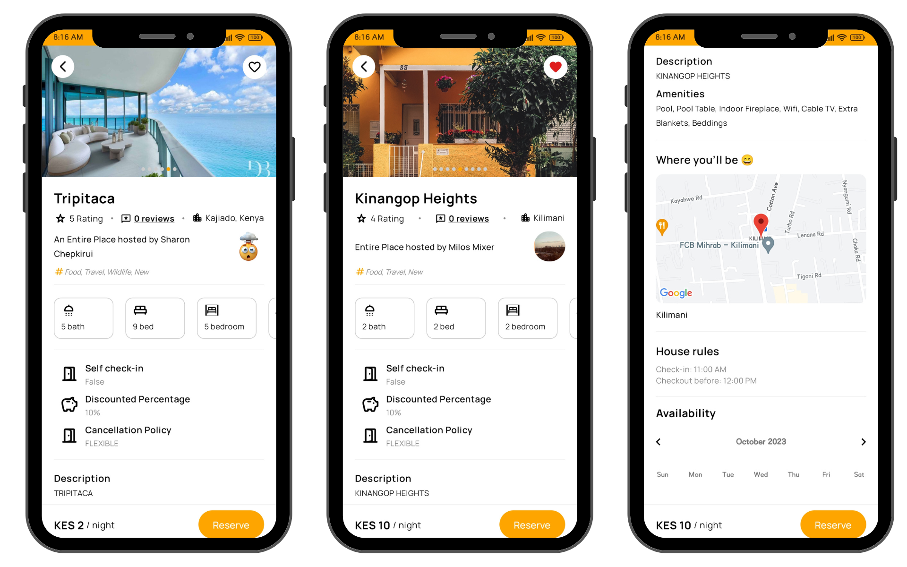

# TravelHub Compose Version - Explore Your Next Adventure 🌍✈️

Travel Hub Compose Version is an Android application that offers a modern and seamless experience for travelers to discover and preview potential host places, explore accommodations, restaurants, attractions, and more. With the latest technologies, this app makes planning your adventures easier than ever.


## Features 🚀

- **User Authentication:** Securely authenticate users using Firebase email/password authentication and Google Sign-In.

- **Explore Listings:** Browse through a diverse range of listings to find the perfect place for your next adventure.

- **Listing Details:** Get detailed information about each listing, including descriptions, amenities, reviews, and more.

- **Interactive Maps:** View the location of each listing on an interactive map with a marker to guide your way.

- **Booking Availability:** Use the built-in calendar component to visualize booked dates for each listing.

## Screenshots 📷

A glimpse of the app in action:





## Usage 📝

1. **Sign in or create an account** to start exploring.
2. **Browse through the listings** and select one to view more details.
3. **View the listing on a map** and check the availability calendar.
4. **Favorite the listing** if you like it.


## Technologies Used  🛠️

- **Android Studio:** The official integrated development environment (IDE) for Android app development.

- **Firebase:** A comprehensive mobile and web application development platform provided by Google, used for user authentication and more.

- **Maps Compose Library:** Integrating Google Maps for location visualization.

- **Dagger Hilt:** A dependency injection library for Android that reduces boilerplate code.

- **Coil:** An image loading library for Android. 

- **Calendar Component:** Prolific Interactive's Calendar Component.

- **Gson:** A Java serialization/deserialization library to convert Java Objects into JSON and back.


## Getting Started 🚀

### Prerequisites

- Android Studio
- Android SDK
- Firebase Project
- Google Maps API Key

### Installation

1. Clone the repo
   ```bash
   git clone https://github.com/your-username/travel-hub-compose.git


2. Open the project in Android Studio


## Issues 🐛
If you encounter any issues, feel free to create an issue request on GitHub. Please provide as much detail as possible.

## License 📜
This project is licensed under the MIT License - see the [LICENSE](LICENSE) file for details.

Made by Lynne M. with ❤️ and ☕